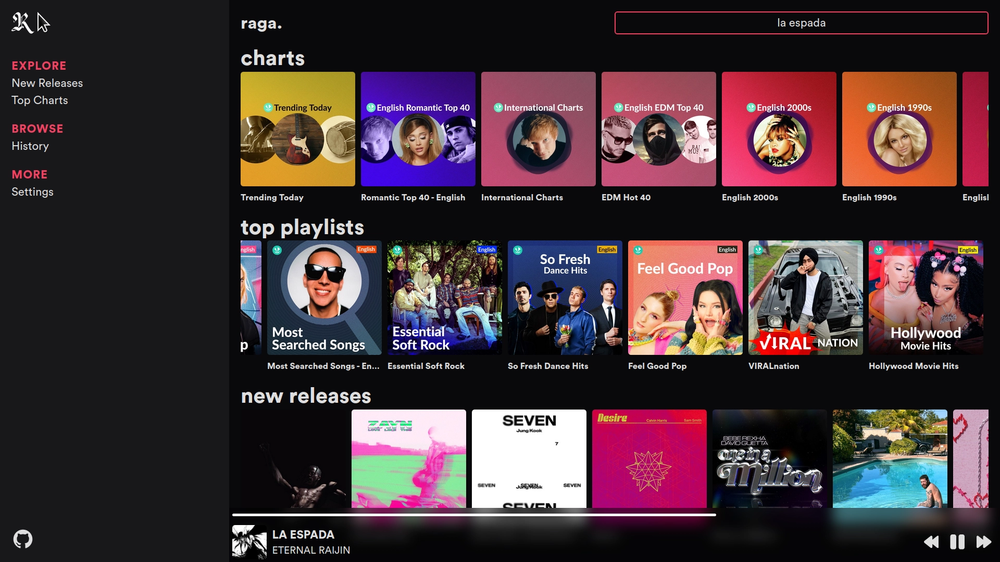
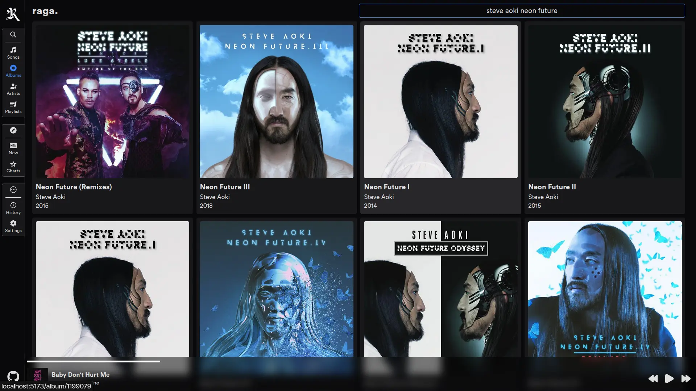

<h1 align="center">raga</h1>

A libre frontend for JioSaavn.

Powered by SvelteKit. ⚡

PS: Thanks for the name, [v8v88v8v88](https://github.com/v8v88v8v88)!

> NB: Proxy is disabled in the [main instance](https://raga.vkdbois.xyz) for now, due to server issues.

### **Consider starring the repo!** 🌟

## Screenshots





## Old Screenshots


## Disclaimer

Raga is not yet complete and is experimental.  
Expect bugs.  
Please open issues if you found any.  
PRs and suggestions are welcome! 😄

## Usage

**Local**

`bun run dev`

**Build**

> NB: As proxy is disabled in the [main instance](https://raga.vkdbois.xyz), manual intervention is required to turn proxy on if you intend to self-host. (MUST BE DONE BEFORE BUILD)
> 
> To turn on proxy:
> - Change proxyURL to the URL in which you have hosted the proxy ([raga-proxy link](https://codeberg.org/aryak/raga-proxy)) in `src/lib/info.js`
> - Change proxyEnabled to true in `src/lib/info.js`

```
# If for Vercel (zero-config build and deploy (uses adapter-auto behind the scenes))
bun run build

# For node app (uses adapter-node behind the scenes)
DEPLOY_TARGET=node bun run build
```

## Dependencies

- [Svelte](https://svelte.dev)
- [SvelteKit](https://kit.svelte.dev)
- [Vite](https://vitejs.dev)
- [raga-proxy](https://codeberg.org/aryak/raga-proxy)
- [Tailwind CSS](https://tailwindcss.com)
- [Forge](https://github.com/digitalbazaar/forge)

## Resources

- [iconify.design](https://icon-sets.iconify.design)