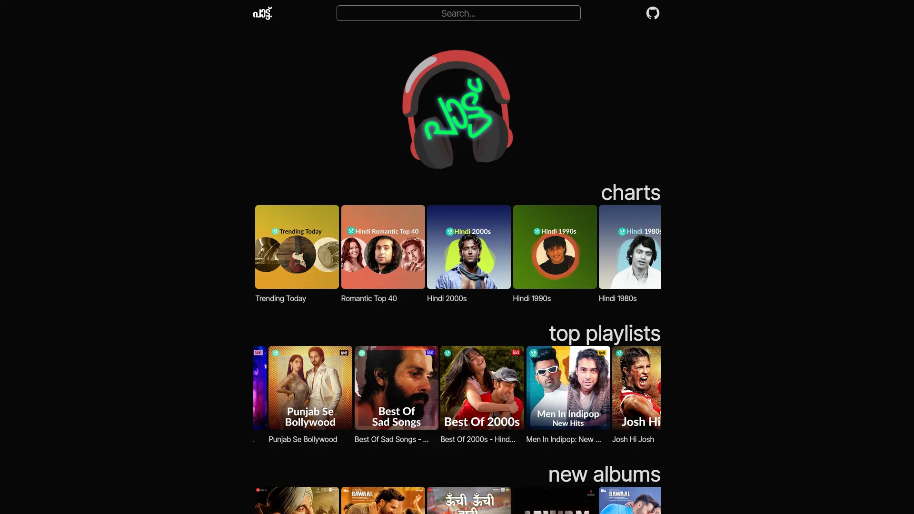
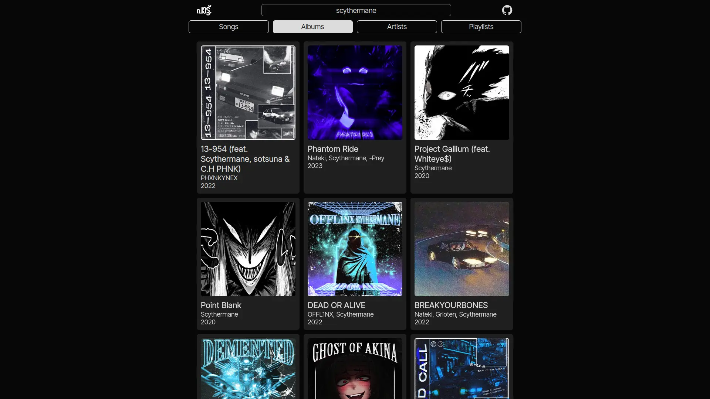
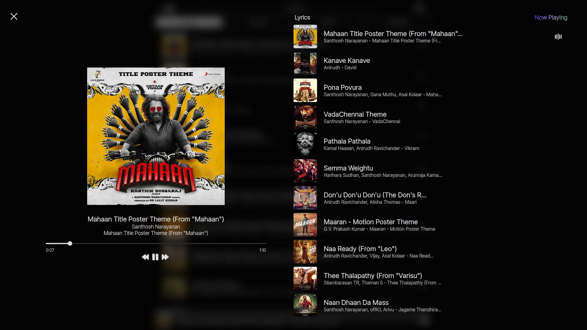

<h1 align="center">raga</h1>
<h5 align="center">(formerly പാട്ട് (paattu))</h6>

A libre frontend which uses the JioSaavn API.

Powered by SvelteKit. ⚡

## Screenshots

## Disclaimer

Raga is not yet complete and is experimental.  
Expect bugs.  
Please open issues if you found any.  
PRs and suggestions are welcome! 😄

## Usage

**Local**

`npm run dev`

**Build**

`npm run build`

## Dependencies

- [Svelte](https://svelte.dev)
- [SvelteKit](https://kit.svelte.dev)
- [Vite](https://vitejs.dev)
- [Tailwind CSS](https://tailwindcss.com)
- [svelte-meta-tags](https://github.com/oekazuma/svelte-meta-tags)
- [Forge](https://github.com/digitalbazaar/forge)
- [Inter Tight](https://rsms.me/inter/)
- [iconify.design](https://icon-sets.iconify.design)

